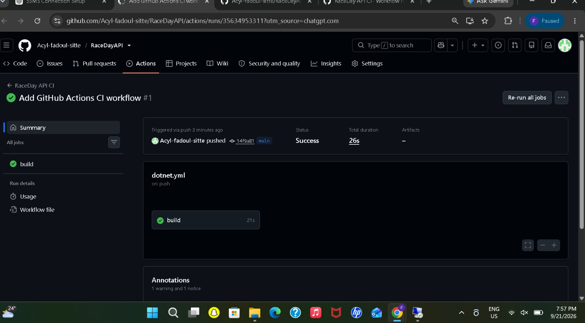

# RaceDay

## 1. Project Overview

RaceDay is a web-based event management system that I am developing for the South African road running, walking, and cycling community.

The purpose of the system is to provide one platform where event organisers can manage sporting events and participants can register for events and view their results.

The system is designed to reduce the problems caused by paper-based registrations, spreadsheets, and disconnected communication.

## 2. Purpose of the System

The main purpose of RaceDay is to make the management of running, walking, and cycling events more organised and easier to manage.

The system will support:

* User registration and login
* Different user roles
* Event management
* Event categories
* Participant enrolments
* Event routes
* Race results
* RESTful API functionality

## 3. User Roles

### Organiser

The Organiser is responsible for managing events on the RaceDay system.

The Organiser can:

* Create and manage events
* Manage event categories
* Manage event routes
* View participant enrolments
* Manage race results

### Participant

The Participant can:

* Create an account and log in
* Browse available events
* View event categories
* Enrol in an event
* View their enrolments
* View their race results

## 4. Project Structure

The project is organised into the following main folders and files:

```text
RaceDayAPI
│
├── Controllers
├── Models
├── Migrations
├── data
│
├── database
│   └── RaceDay.sql
│
├── docs
│   ├── API-Endpoint-Plan.md
│   ├── CI-CD-Success.jpeg
│   ├── RaceDay-ERD.jpeg
│   ├── RaceDay.sql
│   └── SQL-Database-Screenshot files
│
├── Program.cs
├── RaceDayAPI.csproj
├── RaceDayAPI.http
└── README.md
```

## 5. Documentation

The `docs` folder contains the planning documents and evidence required for Part 1.

### RaceDay-ERD.jpeg

The Entity Relationship Diagram shows the database entities, attributes, primary keys, foreign keys, and relationships between the tables.

### API-Endpoint-Plan.md

The API Endpoint Plan documents the RESTful API endpoints, HTTP methods, routes, required roles, request bodies, and expected response codes.

### RaceDay.sql

The SQL script creates the RaceDay database, tables, relationships, constraints, and sample data.

### SQL Database Screenshots

The SQL screenshots provide evidence of the database script being executed successfully in SQL Server Management Studio.

## 6. Database

The RaceDay database is implemented using Microsoft SQL Server.

The database contains the main entities required by the system, including:

* Users
* Events
* Categories
* Enrolments
* Results
* Routes

### SQL Server Configuration

For local development, the SQL Server configuration used was:

* Server: `localhost\SQLEXPRESS`
* Authentication: Windows Authentication
* Trust Server Certificate: Enabled

### Running the Database Script

To create the database:

1. Open SQL Server Management Studio (SSMS).
2. Connect to the SQL Server instance.
3. Open `docs/RaceDay.sql`.
4. Execute the complete script.
5. The script creates the `RaceDayDB` database.
6. Check the tables and sample data in Object Explorer.

## 7. Part 1 Planning Documents

Part 1 includes the following planning and database work:

* Entity Relationship Diagram
* REST API Endpoint Plan
* SQL Server database script
* Database relationships and constraints
* Sample data
* GitHub repository
* Continuous Integration workflow

## 8. CI/CD

GitHub Actions is used to automatically restore and build the .NET project when changes are pushed to the `main` branch or when a pull request is created.

The CI workflow validates that the project can be restored and built successfully.

### CI/CD Evidence

The successful GitHub Actions workflow is shown below:



## 9. Evidence

The following evidence is included in the repository:

* ERD: `docs/RaceDay-ERD.jpeg`
* API Endpoint Plan: `docs/API-Endpoint-Plan.md`
* SQL Script: `docs/RaceDay.sql`
* CI/CD Screenshot: `docs/CI-CD-Success.jpeg`
* SQL Execution Screenshots: `docs/SQL-Database-Screenshot (1).jpeg` to `docs/SQL-Database-Screenshot (6).jpeg`

## 10. YouTube Video

An unlisted YouTube video will be submitted showing the RaceDay Part 1 planning and database work.

The video will explain:

* The planning documents
* ERD design decisions
* API endpoint choices
* SQL database design
* The SQL script being executed live in SQL Server Management Studio

**YouTube Video:** To be added after recording the presentation.

## 11. Project Status

This repository contains the Part 1 work for the RaceDay system, including the database design, Entity Relationship Diagram, REST API planning, SQL Server database script, CI/CD workflow, and supporting documentation.
